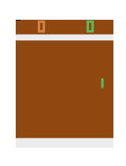

# Deep Q-Network (DQN) for Atari Games

Breakout             |  Pong  |  Space Ms Pacman
:-------------------------:|:-------------------------:|:-------------------------:
  |   |  

## Introduction

This repository contains a PyTorch implementation of the Deep Q-Network (DQN) algorithm for playing Atari games. The implementation is based on the original paper by [Mnih et al. (2015)](https://arxiv.org/pdf/1312.5602) and contains the following extensions:

- Double Q-Learning ([van Hasselt et al., 2015](https://arxiv.org/pdf/1509.06461))
- Dueling Network Architectures ([Wang et al., 2016](https://arxiv.org/pdf/1511.06581))
- Prioritized Experience Replay ([Schaul et al., 2016](https://arxiv.org/pdf/1511.05952))
- Vectorized environment for parallel training

## Installation

It is recommended to install the dependencies in a virtual environment, preferably with [conda](https://docs.conda.io/en/latest/). The following commands will create a new environment and install the required packages using [Poetry](https://python-poetry.org/).

```bash
conda create -n dqn python=3.10
conda activate dqn
pip install poetry
poetry install
```

## Usage

### CLI

The DQN agent can be trained using the command line with [Hydra](https://hydra.cc/). The following command will train a DQN agent to play the Breakout Atari game.

```bash
python src/dqn_atari/main.py model.env_id=BreakoutNoFrameskip-v4
```

Run `python src/dqn_atari/main.py --help` to see all available options.

Noteable features include:

- **Checkpointing**: Set `train.checkpoint_every` to save the model every `n` steps. 
- **Evaluation**: Set `train.eval_every` to evaluate the model every `n` steps.
- **GIF recording**: Set `train.num_gifs` to record `n` GIFs during evaluation.

> Note: only the last checkpoint saves the replay buffer, since it can be large.

### Python

#### Training

The following code snippet demonstrates how to train a DQN agent to play the Breakout Atari game.

```python
from dqn_atari import DQN
from dqn_atari import PrioritizedReplayBuffer

# initialize the DQN agent
dqn_model = DQN(
    'BreakoutNoFrameskip-v4',
    num_envs=8,  # or 1 for single environment
    double_dqn=True,
    dueling=True,
    layers=[64, 64],
    buffer_class=PrioritizedReplayBuffer,
)

# train the agent
dqn_model.train(
    training_steps=1_000_000,
    eval_every=10_000,  # evaluate every 10k steps
    eval_runs=30,
)
```

#### Save and Load

The trained model can be saved and loaded using the `save` and `load` methods. All the training parameters are saved along with the model, so you can continue training the model from where you left off. Because the replay buffer can be large, it is not saved by default. To save the replay buffer, set `include_buffer=True`.

```python
# save and load the model
dqn_model.save('my/folder/breakout.pt', include_buffer=True)
dqn_model = DQN.load('my/folder/breakout.pt')

# continue training the model
dqn_model.train(training_steps=1_000_000)
```

#### Evaluation

The trained agent can be evaluated directly or used to play the game. The following code snippet demonstrates how to evaluate the trained agent and play the game.

```python
import gymnasium as gym
from dqn_atari import wrap_atari

# create the environment
env = gym.make('BreakoutNoFrameskip-v4')
env = wrap_atari(env)

# use `get_action` to play the game
state, _ = env.reset()
done = False
reward = 0
while not done:
    action = dqn_model.get_action(state)
    state, reward, done, *_ = env.step(action)
    reward += reward
print(f'Total reward: {reward}')

# Or use `evaluate` to evaluate the agent directly
reward = dqn_model.evaluate(eval_runs=20)
print(f'Average reward: {reward}')
```
